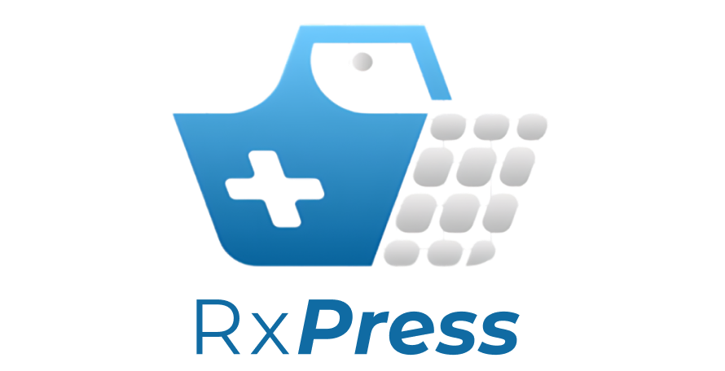

<a id="readme-top"></a>
<div align="center">
  <a href="https://github.com/othneildrew/Best-README-Template">
    
  </a>
  <p align="center"><i>The RxPress Medicine Pharmacy System is a Django-based web application designed to streamline pharmacy processes, including inventory management, order tracking, and customer interactions. It offers an intuitive user interface for both pharmacy staff and customers, making it easy to manage medicines and place orders.</i></p>
  <a href="https://github.com/berna-ahito/RxPress-A-Medicine-Pharmacy-System/stargazers"></a>
<a href="https://github.com/eynabdllh/pet-adoption-system/network/members"></a>
<a href="https://github.com/berna-ahito/RxPress-A-Medicine-Pharmacy-System/pulls"></a>
<a href="https://github.com/berna-ahito/RxPress-A-Medicine-Pharmacy-System/issues"></a>
<a href=https://github.com/eynabdllh/pet-adoption-system/graphs/contributors"></a>
<a href="https://github.com/berna-ahito/RxPress-A-Medicine-Pharmacy-System/blob/main/LICENSE"></a>
</div>
<br>

---

## Table of Contents

- [Introduction](#introduction)
- [Features](#features)
- [Built With](#built-with)
- [Getting Started](#getting-started)
  - [Prerequisites](#prerequisites)
- [ERD](#erd-entity-relationship-diagram)
- [UI/UX](#uiux-design)
- [Gantt Chart](#gantt-chart)
- [Developers](#developers)
- [Top Contributors](#top-contributors)
- [License](#license)

---

## Introduction


**RxPress** aims to create a medicine online platform designed for convenience for purchasing medication products. It connects customers with pharmacies, allowing them to place orders online, while pharmacies can manage their stock and track orders through the system. It also covers the entire lifecycle of medicine transactions, from browsing and selecting products to payment processing. It includes functionalities for users to browse and order medicines, view their order history, and manage their accounts.

<p align="right">(<a href="#readme-top">back to top</a>)</p>

---

## Features
1. **User Registration and Authentication:** Customers can create an account and login.
2. **Profile Management:** Customers can edit their account details such as can change name, email, and password.
3. **Order Management:** Customers can track the status of the orders such as viewing past orders and reordering products.
4. **Shopping Cart and Checkout Process:** Customers can add, remove, update product in cart, and check out. 
5. **Payment Processing:** Customers can secure the financial transactions, secure the payment information, multiple payment.
6. **Medicine Catalog:** Customers can view detailed information about each medicine, including name, description, price, and stock status.
7. **Inventory Management:** Allows administrators to manage the stock of medicines in the system. Administrators can get, add, update, and delete new medicines with their categories, descirption, price, and stock to the inventory.
<p align="right">(<a href="#readme-top">back to top</a>)</p>

---

## Built With
<section id="technologies">
  <a href="https://www.djangoproject.com/" target="_blank">
    
  </a>
  <a href="https://getbootstrap.com" target="_blank">
    
  </a>
  <a href="https://www.w3.org/Style/CSS/" target="_blank">
    
  </a>
  <a href="https://html.spec.whatwg.org/multipage/" target="_blank">
      
  </a>
  <a href="https://www.javascript.com/" target="_blank">
      
  </a>
</section>

<p align="right">(<a href="#readme-top">back to top</a>)</p>

---

## Getting Started

This is an example of how you may give instructions on setting up your project locally.
To get a local copy up and running, follow these simple steps.

### Prerequisites

This is an example of how to list things you need to use for the software, and how to install them.
#### 1. Install Python
Install ```python-3.12.5```. Follow the steps from the referenced document below based on your Operating System.
Reference: [https://docs.python-guide.org/starting/installation/](https://docs.python-guide.org/starting/installation/) 

#### 2. Setup virtual environment
```bash
# Create a virtual environment
python -m venv venv

# Activate the virtual environment
venv/scripts/Activate

# Install dependencies
pip install openpyxl
```

#### 3. Installation

1. Clone the repo
   ```sh
   git clone https://github.com/berna-ahito/RxPress-A-Medicine-Pharmacy-System
   ```
2. Install Requirements
   ```sh
   pip install -r requirements.txt
   ```
3. Migrate database
    ```sh
   py manage.py makemigrations
   py manage.py migrate
   ```
4. Run the server
   ```sh
    py manage.py runserver
    ```
<p align="right">(<a href="#readme-top">back to top</a>)</p>

---

## Gantt Chart

The timeline for the development of this project is available in the Gantt Chart below:

[Gantt Chart](documents/Gantt_Chart/GanttChart_RxPress.pdf)

<p align="right">(<a href="#readme-top">back to top</a>)</p>

---
## ERD (Entity Relationship Diagram)

The following ERD outlines the relationships between entities in the system, such as users, pets, and adoption requests:

[ERD Diagram](documents/ERD/RxPress_ERD.png)

<p align="right">(<a href="#readme-top">back to top</a>)</p>

---

## UI/UX Design

The design and layout of the user interface can be explored via the Figma link below:

[UI/UX Design](https://www.figma.com/design/hclbwOZiAfHJtQUMpU0ufz/CSIT327---IM2---SYSTEM-UI%2FUX?node-id=0-1&t=l2Inp7193Z73KgIa-1)

<p align="right">(<a href="#readme-top">back to top</a>)</p>

---
## Developers
<div>
  <table>
    <tr>
      <th>Developers</th>
      <th>Assigned Apps</th>
    </tr>
    <tr>
      <td align="center">
        <strong>Bernadeth Claire G. Ahito</strong><br>
        <a href="https://github.com/berna-ahito"></a>
      </td>
      <td>
        <p>Accounts & Shopping Cart</p>
      </td>
    </tr>
    <tr>
      <td align="center">
        <strong>Juvie R. Coca</strong><br>
        <a href="https://github.com/Juvie-cmd"></a>
      </td>
      <td>
        <p> Homepage, Orders</p>
      </td>
    </tr>
    <tr>
      <td align="center">
        <strong>Kiana Marquisa S. Del Mar</strong><br>
        <a href="https://github.com/KianaDelMar"></a>
      </td>
      <td>
        <p>Admin Dashboard, Sign in, Sign up</p>
      </td>
    </tr>
  </table>
</div>

---
## Top Contributors
<a href="https://github.com/berna-ahito/RxPress-A-Medicine-Pharmacy-System/graphs/contributors">
  
</a>

<p align="right">(<a href="#readme-top">back to top</a>)</p>

---

## License
This project is open-source and licensed under the MIT License.  See `LICENSE.txt` for more information.
<p align="right">(<a href="#readme-top">back to top</a>)</p>
